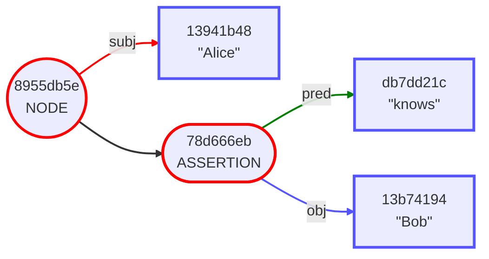

## `envelope` - Overview of the Commands

**See Associated Video:**

[](https://youtu.be/K2gFTyjbiYk)

### Help

Help is available for the tool and its subcommands.

```bash
👉
envelope help
```

```
👈
OVERVIEW: A tool for manipulating the Gordian Envelope data type.

USAGE: envelope <subcommand>

OPTIONS:
  --version               Show the version.
  -h, --help              Show help information.

SUBCOMMANDS:
  assertion               Work with the envelope's assertions.
  compress                Compress the envelope or its subject.
  digest                  Print the envelope's digest.
  decrypt                 Decrypt the envelope's subject using the provided key.
  elide                   Elide a subset of elements.
  encrypt                 Encrypt the envelope's subject using the provided key.
  extract                 Extract the subject of the input envelope.
  format (default)        Print the envelope in Envelope Notation.
  generate                Utilities to generate and convert various objects.
  proof                   Work with inclusion proofs.
  diff                    Work with envelope diffs.
  salt                    Add random salt to the envelope.
  sign                    Sign the envelope with the provided private key base.
  sskr                    Sharded Secret Key Reconstruction (SSKR).
  subject                 Create an envelope with the given subject.
  uncompress              Uncompress the envelope or its subject.
  verify                  Verify a signature on the envelope using the provided public key base.

  See 'envelope help <subcommand>' for detailed help.
```

Here is an example envelope we'll use in many of the examples below. The `envelope` tool expects input and produces output for a number of types it uses in UR format.

```bash
👉
ALICE_KNOWS_BOB=ur:envelope/lftpcsihfpjziniaihoytpcsihjejtjlktjktpcsiafwjliddssngwct
```

### Format

The `format` command is the default. This means that you can just feed an envelope in UR format into the tool and it will print out its formatted contents in envelope notation.

```bash
👉
envelope $ALICE_KNOWS_BOB    # Equivalent to `envelope format $ALICE_KNOWS_BOB`
```

```
👈
"Alice" [
    "knows": "Bob"
]
```

#### Hex CBOR Output

The `format` command has several output format options. For example, you can output the hexadecimal of the raw CBOR for the envelope:

```bash
👉
envelope --cbor $ALICE_KNOWS_BOB
```

```
👈
d8c882d81865416c696365a1d818656b6e6f7773d81863426f62
```

#### CBOR Diagnostic Notation Output

Or your can output the annotated CBOR diagnostic annotation of the envelope:

```bash
👉
envelope --diag $ALICE_KNOWS_BOB
```

```
👈
200(   / envelope /
   [
      24("Alice"),   / leaf /
      {
         24("knows"):   / leaf /
         24("Bob")   / leaf /
      }
   ]
)
```

### Tree Output

The envelope tree notation shows the structure of the envelope as a tree:

```bash
envelope format --tree $ALICE_KNOWS_BOB
```

```
8955db5e NODE
    13941b48 subj "Alice"
    78d666eb ASSERTION
        db7dd21c pred "knows"
        13b74194 obj "Bob"
```

With the `--hide-nodes` option, the semantic structure of the envelope is shown without digests:

```bash
envelope format --tree --hide-nodes $ALICE_KNOWS_BOB
```

```
"Alice"
    ASSERTION
        "knows"
        "Bob"
```

#### Mermaid Output

Or you can output your envelope in [Mermaid](https://mermaid-js.github.io/) format, which resolves to a graphical representation of the envelope hierarchy when placed in a markdown file (like this one.) Each element in the graph shows an abbreviated version of its digest.

```bash
👉
envelope --mermaid $ALICE_KNOWS_BOB
```

👈


### Subject

The `subject` command creates a new envelope with the given subject. You can specify the data type of the subject; `string` is the default.

```bash
# Equivalent to `envelope subject --string "Hello."`
👉
envelope subject "Hello."
```

```
👈
ur:envelope/tpcsiyfdihjzjzjldmprrhtypk
```

When we feed this envelope back into the default `format` command, we get the envelope printed in envelope notation. This is why `"Hello."` is printed with quotes around it:

```bash
👉
envelope ur:envelope/tpcsiyfdihjzjzjldmprrhtypk
```

```
👈
"Hello."
```

### Extract

To extract the actual data of the envelope's subject, use the `extract` command:

```bash
# Equivalent to `envelope extract --string ur:envelope/tpcsiyfdihjzjzjldmprrhtypk`
👉
envelope extract ur:envelope/tpcsiyfdihjzjzjldmprrhtypk
```

```
👈
Hello.
```

In an envelope with assertions, the `extract` command just returns the subject without the assertions:

```bash
👉
envelope extract $ALICE_KNOWS_BOB
```

```
👈
Alice
```

If you want the subject returned as an envelope, use the `--envelope` data type:

```bash
👉
envelope extract --envelope $ALICE_KNOWS_BOB
```

```
👈
ur:envelope/tpcsihfpjziniaihnsrsnyue
```

```bash
👉
envelope ur:envelope/tpcsihfpjziniaihnsrsnyue
```

```
👈
"Alice"
```

### Assertion

To add an assertion to an existing envelope, use the `assertion` command. In this example, `envelope` is invoked twice, once to create the envelope with its subject, and the second to add an assertion to it:

```bash
👉
envelope subject "Alice" | envelope assertion "knows" "Bob"
```

```
👈
ur:envelope/lftpcsihfpjziniaihoytpcsihjejtjlktjktpcsiafwjliddssngwct
```

Note that we have just constructed the `$ALICE_KNOWS_BOB` example envelope from scratch!

The `assertion` command has several subcommands that help us work with assertions:

```bash
👉
envelope help assertion
```

```
👈
OVERVIEW: Work with the envelope's assertions.

USAGE: envelope assertion <subcommand>

OPTIONS:
  --version               Show the version.
  -h, --help              Show help information.

SUBCOMMANDS:
  add (default)           Add an assertion to the given envelope.
  create                  Create a bare assertion with the given predicate and object.
  remove                  Remove an assertion from the given envelope.
  count                   Print the count of the envelope's assertions.
  at                      Retrieve the assertion at the given index.
  all                     Retrieve all the envelope's assertions.
  find                    Find all assertions matching the given criteria.

  See 'envelope help assertion <subcommand>' for detailed help.
```

### Digest

Every envelope produces a unique `Digest`, and since every part of an envelope is *itself* an envelope, every part also has its own unique Digest.

This prints the digest of the envelope as a whole:

```bash
👉
envelope digest $ALICE_KNOWS_BOB
```

```
👈
ur:digest/hdcxldgouyhyadimzmpaeourhfsectvaskspdlotaxidiatbgydejnbwgskbhfrtwlwzneroatds
```

While this prints the digest of the *subject* of the envelope:

```bash
👉
envelope extract --envelope $ALICE_KNOWS_BOB | envelope digest
```

```
👈
ur:digest/hdcxbwmwcwfdkecauerfvsdirpwpfhfgtalfmulesnstvlrpoyfzuyenamdpmdcfutdlstyaqzrk
```

Note that the two digests above are different.

Let's print the digest of the example envelope's assertion:

```bash
👉
envelope assertion at 0 $ALICE_KNOWS_BOB | envelope digest
```

```
👈
ur:digest/hdcxkstbiywmmygsasktnbfwhtrppkclwdcmmugejesokejlbnftrdwspsmdcechbboerhzebtws
```

Finally, let's print the digest of the object of the envelope's assertion:

```bash
👉
envelope assertion at 0 $ALICE_KNOWS_BOB |    # Gets the assertion
    envelope extract --object |               # Gets the object of the assertion
    envelope digest                           # Prints the digest
```

```
👈
ur:digest/hdcxbwrlfpmwnsemrovtnssrtnotcfgshdvezcjedlbbtypatiwtecoxjnjnhtcafhbysptsnsnl
```

### Elision

Now that we can use digests to specify the parts of an envelope, we can transform it in interesting ways. Elision means to remove various parts of an envelope without changing its digest. The `elide` command and its two subcommands `removing` and `revealing` (the default) provide this service.

Let's start by getting the digest of the subject of our example envelope:

```bash
👉
SUBJECT_DIGEST=`envelope extract --envelope $ALICE_KNOWS_BOB | envelope digest`
echo $SUBJECT_DIGEST
```

```
👈
ur:digest/hdcxbwmwcwfdkecauerfvsdirpwpfhfgtalfmulesnstvlrpoyfzuyenamdpmdcfutdlstyaqzrk
```

Now if we want to produce a version of the envelope with its subject elided, we provide that digest to the `elide removing` command. Here we do the elision then immediately pipe the resulting envelope to the `format` command:

```bash
👉
envelope elide removing $ALICE_KNOWS_BOB $SUBJECT_DIGEST | envelope
```

```
👈
ELIDED [
    "knows": "Bob"
]
```

We can provide any number of digests in the "target set" of the `elide` command. If the `elide removing` command is used, then *only* the elements in the set will be elided. If the `elide revealing` command is used, then all *but* the elements in the set will be elided.

Here we provide two digests: the first for the subject as above, and the digest that represents the object of the assertion we produced previously using the `digest` command:

```bash
👉
BOB_DIGEST=ur:digest/hdcxbwrlfpmwnsemrovtnssrtnotcfgshdvezcjedlbbtypatiwtecoxjnjnhtcafhbysptsnsnl
envelope elide removing $ALICE_KNOWS_BOB $SUBJECT_DIGEST $BOB_DIGEST | envelope
```

```
👈
ELIDED [
    "knows": ELIDED
]
```

Now this is important: the elided version of the envelope we produced has the *same* digest as the original, un-elided envelope. This means that things like cryptographic signatures added to the envelope as assertions, if not themselves elided, will *still verify*.

Let's compare the original envelope's digest to the elided version's digest:

```bash
👉
envelope digest $ALICE_KNOWS_BOB
```

```
👈
ur:digest/hdcxldgouyhyadimzmpaeourhfsectvaskspdlotaxidiatbgydejnbwgskbhfrtwlwzneroatds
```

```bash
👉
envelope elide removing $ALICE_KNOWS_BOB $SUBJECT_DIGEST $BOB_DIGEST | envelope digest
```

```
👈
ur:digest/hdcxldgouyhyadimzmpaeourhfsectvaskspdlotaxidiatbgydejnbwgskbhfrtwlwzneroatds
```

So even though the original and elided versions are in fact *different envelopes*, their digests are *exactly the same!*

### Symmetric Key Encryption

The `envelope` tool provides the `encrypt` and `decrypt` commands to perform symmetric key encryption of an envelope's subject. Why not the *whole* envelope? That's easy too, and we'll get to it shortly, but first we need a key. `envelope` has the `generate key` command that generates a new encryption key.

```bash
👉
KEY=`envelope generate key`
echo $KEY
```

```
👈
ur:crypto-key/hdcxwfmnsbasamfgptbkwtvofgctmwroldcxjnltwsatzsdmimhlvehlsphebsfrzcssbzinhnrd
```

Once we have this, we can produce a version of our example envelope that has its subject encrypted:

```bash
👉
ENCRYPTED=`envelope encrypt $ALICE_KNOWS_BOB --key $KEY`
envelope $ENCRYPTED
```

```
👈
ENCRYPTED [
    "knows": "Bob"
]
```

Note that encryption uses randomness to help hide what has been encrypted. So each time you perform an encryption, the resulting envelope will be different:

```bash
👉
envelope encrypt $ALICE_KNOWS_BOB --key $KEY
```

```
👈
ur:envelope/lftansfwlrgemudytouolnmtisaauosngsurlouozontzeahrphfashnbngdstghadsapkbgzsflcsamwemerpvsbksbhddatansfphdcxbwmwcwfdkecauerfvsdirpwpfhfgtalfmulesnstvlrpoyfzuyenamdpmdcfutdloytpcsihjejtjlktjktpcsiafwjlidwnbevwax
```

```bash
👉
envelope encrypt $ALICE_KNOWS_BOB --key $KEY
```

```
👈
ur:envelope/lftansfwlrgepsuyvdtiplfrnlwnytengssrgacpynmtrtlthkbswnqduogdsbecssvteccyntjecantahtsasvwetfhhddatansfphdcxbwmwcwfdkecauerfvsdirpwpfhfgtalfmulesnstvlrpoyfzuyenamdpmdcfutdloytpcsihjejtjlktjktpcsiafwjlidvyzmpkdk
```

But notice! When you encrypt parts of an envelope, its *digest* remains the same as the unencrypted version:

```bash
👉
envelope digest $ALICE_KNOWS_BOB
```

```
👈
ur:digest/hdcxldgouyhyadimzmpaeourhfsectvaskspdlotaxidiatbgydejnbwgskbhfrtwlwzneroatds
```

```bash
👉
envelope encrypt $ALICE_KNOWS_BOB --key $KEY | envelope digest
```

```
👈
ur:digest/hdcxldgouyhyadimzmpaeourhfsectvaskspdlotaxidiatbgydejnbwgskbhfrtwlwzneroatds
```

If you want the digest to be different each time you encrypt, you can add random salt to the envelope; see below.

So far we've just encrypted the subject of an envelope. But what if we want to encrypt the entire envelope, including its assertions?

For this, you simply wrap the envelope in an outer envelope, and encrypt that!

```bash
👉
WRAPPED=`envelope subject --wrapped $ALICE_KNOWS_BOB`
envelope $WRAPPED
```

```
👈
{
    "Alice" [
        "knows": "Bob"
    ]
}
```

The outer envelope has just a subject, which is the entire contents of the inner envelope!

What's the advantage in doing things this way? Once you have a wrapped envelope, you can add additional assertions to it, like signatures, that will still verify even if the subject has been encrypted or elided!

Note that since we created a new envelope by doing the wrapping, that this new envelope will *not* have the same digest as its inner envelope:

```bash
👉
envelope digest $ALICE_KNOWS_BOB
```

```
👈
ur:digest/hdcxldgouyhyadimzmpaeourhfsectvaskspdlotaxidiatbgydejnbwgskbhfrtwlwzneroatds
```

```bash
👉
envelope digest $WRAPPED
```

```
👈
ur:digest/hdcxzclocydkrespdwwygrldbyvabyplolrdfgfnsolnjkgwledyvwhtghlncylkhgdnltdkjest
```

```bash
👉
WRAPPED_ENCRYPTED=`envelope encrypt $WRAPPED --key $KEY`
envelope $WRAPPED_ENCRYPTED
```

```
👈
ENCRYPTED
```

This encrypted envelope still has the same digest as the wrapped but unencrypted version:

```bash
👉
envelope digest $WRAPPED
```

```
👈
ur:digest/hdcxzclocydkrespdwwygrldbyvabyplolrdfgfnsolnjkgwledyvwhtghlncylkhgdnltdkjest
```

```bash
👉
envelope digest $WRAPPED_ENCRYPTED
```

```
👈
ur:digest/hdcxzclocydkrespdwwygrldbyvabyplolrdfgfnsolnjkgwledyvwhtghlncylkhgdnltdkjest
```

To recover the original envelope we reverse the steps, first decrypting, then unwrapping:

```bash
👉
envelope decrypt $WRAPPED_ENCRYPTED --key $KEY |   # Decrypt the envelope
    envelope extract --wrapped |                   # Unwrap the inner envelope
    envelope                                       # Show the formatted contents
```

```
👈
"Alice" [
    "knows": "Bob"
]
```

### Signatures

Similar to how you can encrypt an envelope's subject, you can also cryptographically sign the subject by adding an assertion. Since signing uses public key cryptography, we first need a private/public key pair known as a PrivateKeyBase. This can be used to sign and decrypt messages encrypted with the corresponding public key

```bash
👉
envelope generate prvkeys
```

```
👈
ur:crypto-prvkeys/hdcxhdvsaelylaaesfqdwzghfmsswfrlzsfgytbbnecpkshekstbhdwzrkktasknztkecycaotda
```

The above generation is random. If you wish to use a `crypto-seed` as your starting point:

```bash
👉
SEED=ur:crypto-seed/oyadgdmdeefejoaonnatcycefxjedrfyaspkiakionamgl
PRVKEYS=`envelope generate prvkeys $SEED`
echo $PRVKEYS
```

```
👈
ur:crypto-prvkeys/gdmdeefejoaonnatcycefxjedrfyaspkiawdioolhs
```

Of course, we'll also want to distribute the public key, so the signature can be verified:

```bash
👉
PUBKEYS=`envelope generate pubkeys $PRVKEYS`
echo $PUBKEYS
```

```
👈
ur:crypto-pubkeys/lftanshfhdcxweplrnkpsruepkaeahnetppsteaojtdlgudetlyksrlbzoiduoglpemujydnsrattansgrhdcximbgoskbjpgtluwededpjywdlkfwksjpglsrfdcaurdahycfasmtylihpfrsfgkblomttisr
```

Now we can sign our envelope:

```bash
👉
SIGNED=`envelope sign $ALICE_KNOWS_BOB --prvkeys $PRVKEYS`
```

Let's see what it looks like when formatted now:

```bash
👉
envelope $SIGNED
```

```
👈
"Alice" [
    "knows": "Bob"
    'verifiedBy': Signature
]
```

OK... there's a signature there now, but it's a new assertion on the subject of the envelope, "Alice". This means that any of the assertions can still be altered without invalidating the signature on the subject. But what if we want to sign the *whole* envelope, including the fact that she knows Bob?

Wrapping to the rescue again!

```bash
👉
WRAPPED_SIGNED=`envelope subject --wrapped $ALICE_KNOWS_BOB | envelope sign --prvkeys $PRVKEYS`
envelope $WRAPPED_SIGNED
```

```
👈
{
    "Alice" [
        "knows": "Bob"
    ]
} [
    'verifiedBy': Signature
]
```

Now the entire contents of the envelope are signed, and if we send it to someone who has our public key, they can verify the signature:

```bash
👉
envelope verify $WRAPPED_SIGNED --pubkeys $PUBKEYS
```

```
👈
ur:envelope/lftpsplftpcsihfpjziniaihoytpcsihjejtjlktjktpcsiafwjlidoyaxtpcstansghhdfznltbglechtrkecemfhahkbrkcfzcasfnbbkpktzmsrvewtksknahmnpkinguktdwkgfrdklfrtdwpssamujtidcteovyongeamayftfxiaesfwceecoxueimmhwfrsyaidiycwdl
```

To facilitate piping commands, the `verify` command prints the input envelope if the validation is successful (unless the `--silent` flag is provided), and exits with an error condition if it is unsuccessful. Lets produce some incorrect public keys and try this:

```bash
👉
BAD_PUBKEYS=`envelope generate prvkeys | envelope generate pubkeys`
envelope verify $WRAPPED_SIGNED --pubkeys $BAD_PUBKEYS
```

```
👈
Error: unverifiedSignature
```

Note that like encryption, signing uses randomness. So even if you sign the same envelope twice with the same private key, the two resulting envelopes will not be the same although both signatures will verify against the same public key.

### SSKR

SSKR lets you split ("shard") an envelope into several shares, a threshold of which is necessary to recover the original message. If we shard our example envelope into 3 shares and assign them to a shell array, we get:

```bash
👉
SHARE_ENVELOPES=(`envelope sskr split -g 2-of-3 $ALICE_KNOWS_BOB`)
echo $SHARE_ENVELOPES
```

```
👈
ur:envelope/lftansfwlrhdcerfserhcmcfvdlslrloylsfimnddwpewpynnypflrmsyaidoerpwkbntygswknlbdchghgadsrernvleckpgdrkpamuhhjlostpfnhpspaecftsfsdkurhddatansfphdcxzclocydkrespdwwygrldbyvabyplolrdfgfnsolnjkgwledyvwhtghlncylkhgdnoyamtpcstaadechddaeyfzaeadaewmtbtkaxlnlflpfgnewdflflwzecvlfmlrkemucakemykbotrdlpoyhybsnbfmglvtbdwldl ur:envelope/lftansfwlrhdcerfserhcmcfvdlslrloylsfimnddwpewpynnypflrmsyaidoerpwkbntygswknlbdchghgadsrernvleckpgdrkpamuhhjlostpfnhpspaecftsfsdkurhddatansfphdcxzclocydkrespdwwygrldbyvabyplolrdfgfnsolnjkgwledyvwhtghlncylkhgdnoyamtpcstaadechddaeyfzaeadadkiflhswnplkonbfglyhhsfdneomevokidejtjptkwfrogocktylfutinbzlrcldknlctdigl ur:envelope/lftansfwlrhdcerfserhcmcfvdlslrloylsfimnddwpewpynnypflrmsyaidoerpwkbntygswknlbdchghgadsrernvleckpgdrkpamuhhjlostpfnhpspaecftsfsdkurhddatansfphdcxzclocydkrespdwwygrldbyvabyplolrdfgfnsolnjkgwledyvwhtghlncylkhgdnoyamtpcstaadechddaeyfzaeadaouowslozttbjstkfgotntgenejeiyvyrosthdgeoekkvydesaiyluhkdyfrvsaenyghnnhpps
```

For brevity, we assign the elements of the array three shell variables: `$SHARE_1`, `SHARE_2`, and `SHARE_3`:

```bash
👉
SHARE_1=${SHARE_ENVELOPES[1]}
SHARE_2=${SHARE_ENVELOPES[2]}
SHARE_3=${SHARE_ENVELOPES[3]}
```
> 🔥 **WARNING:** The above arrays assume you are using `zsh` on your Mac, which has been the default shell since 2019. However, if you have a user account that was created before Catalina (2019), and you've never upgraded your shell, then you're still using `bash`. In this case, the arrays will be numbered [0], [1], and [2].

If we format the first of those shares, we see that the subject is a symmetrically encrypted message, and its assertion is an SSKR share, which is one of the shares needed to decrypt the subject.

```bash
👉
envelope $SHARE_1
```

```
👈
ENCRYPTED [
    'sskrShare': SSKRShare
]
```

Taking the first and third of those shares, we can recover the original envelope:

```bash
👉
RECOVERED=`envelope sskr join $SHARE_1 $SHARE_3`
envelope $RECOVERED
```

```
👈
"Alice" [
    "knows": "Bob"
]
```

But just one of the shares is insufficient:

```bash
👉
envelope sskr join $SHARE_2
```

```
👈
Error: invalidShares
```

### Salt

Envelopes with the same content produce the same digests, even when elided or encrypted. This can make identical or even similar envelopes *correlatable*.

Here we compare the digests produced by the plaintext and encrypted versions of the same envelope:

```bash
👉
KEY=`envelope generate key`
WRAPPED=`envelope subject --wrapped $ALICE_KNOWS_BOB`
ENCRYPTED=`envelope encrypt $WRAPPED --key $KEY`
envelope digest $WRAPPED; envelope digest $ENCRYPTED
```

```
👈
ur:digest/hdcxzclocydkrespdwwygrldbyvabyplolrdfgfnsolnjkgwledyvwhtghlncylkhgdnltdkjest
ur:digest/hdcxzclocydkrespdwwygrldbyvabyplolrdfgfnsolnjkgwledyvwhtghlncylkhgdnltdkjest
```

The `salt` command lets us add an assertion with random data. If we do this before encrypting, the unencrypted subject will be the same, but the digest will be different:

```bash
👉
SALTED_WRAPPED=`envelope salt $ALICE_KNOWS_BOB | envelope subject --wrapped`
envelope $SALTED_WRAPPED
```

```
👈
{
    "Alice" [
        "knows": "Bob"
        'salt': Salt
    ]
}
```

```bash
👉
SALTED_ENCRYPTED=`envelope encrypt $SALTED_WRAPPED --key $KEY`
envelope digest $ENCRYPTED; envelope digest $SALTED_ENCRYPTED
```

```
👈
ur:digest/hdcxzclocydkrespdwwygrldbyvabyplolrdfgfnsolnjkgwledyvwhtghlncylkhgdnltdkjest
ur:digest/hdcxpdestpchbgayvtjpwyhhknglurkpftfltsiahlwslnknchrsrfswrssevwsnghrebtisknpe
```

### Compression

Envelopes can be compressed. Similar to elision and encryption, the digest of an envelope does not change when it is compressed.

Let's define a helper function to output the number of CBOR bytes an envelope contains when encoded:

```
👈
function env_cbor_count { envelope format --cbor "$1" | wc -c | bc -l <<< "($(cat)) / 2" | xargs printf "%.0f\n" }
```

In this example, we create an envelope with a long text note then print the number of bytes it takes to encode as CBOR and the envelope's digest.

```bash
👈
NOTE='Lorem ipsum dolor sit amet consectetur adipiscing elit mi nibh ornare proin blandit diam ridiculus, faucibus mus dui eu vehicula nam donec dictumst sed vivamus bibendum aliquet efficitur. Felis imperdiet sodales dictum morbi vivamus augue dis duis aliquet velit ullamcorper porttitor, lobortis dapibus hac purus aliquam natoque iaculis blandit montes nunc pretium.'
ENVELOPE=`envelope subject "Alice" | envelope assertion --known note --string "${NOTE}${NOTE}${NOTE}"`
env_cbor_count $ENVELOPE
envelope digest $ENVELOPE
```

```bash
👉
1110
ur:digest/hdcxykfgenetdppftsuyhngwglrdiopsmtgshpteprchcaasvyiasbjldaqzcpfhzmcfcarkjepf
```

Now we compress the envelope, and again print the number of bytes it takes to encode and its digest. Note that although the number of bytes has gone down significantly, the digest remains the same.

```bash
👉
COMPRESSED=`envelope compress $ENVELOPE`
env_cbor_count $COMPRESSED
envelope digest $COMPRESSED
```

```
312
ur:digest/hdcxykfgenetdppftsuyhngwglrdiopsmtgshpteprchcaasvyiasbjldaqzcpfhzmcfcarkjepf
```

When an envelope is compressed, you treat it like any other envelope (add assertions to it, use it as the object of an assertion, etc.) but you can't access its contents until it's been uncompressed.

```bash
👉
envelope $COMPRESSED
```

```
👈
COMPRESSED
```

When the envelope is uncompressed, it returns to its original size.

```bash
👉
UNCOMPRESSED=`envelope uncompress $COMPRESSED`
env_cbor_count $UNCOMPRESSED
envelope digest $UNCOMPRESSED
```

```
👈
1110
ur:digest/hdcxykfgenetdppftsuyhngwglrdiopsmtgshpteprchcaasvyiasbjldaqzcpfhzmcfcarkjepf
```

The above technique compresses the entire envelope. You can also compress or uncompress just the subject of an envelope by adding the `--subject` flag:

```bash
👉
ALICE_COMPRESSED=`envelope compress --subject $ALICE_KNOWS_BOB`
envelope $ALICE_COMPRESSED
```

```
👈
COMPRESSED [
    "knows": "Bob"
]
```

Note that compression (like encryption) has a fixed storage overhead. So very short envelopes, like the subject of this envelope may actually become longer when compressed.

```bash
👉
env_cbor_count $ALICE_KNOWS_BOB
env_cbor_count $ALICE_COMPRESSED
```

```
👈
26
76
```

Finally, note that compressing an already-compressed envelope, or uncompressing an already uncompressed envelope, has no effect.
